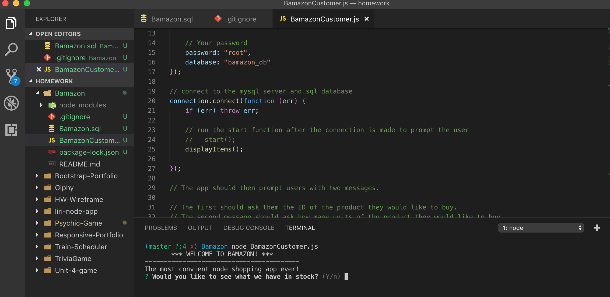
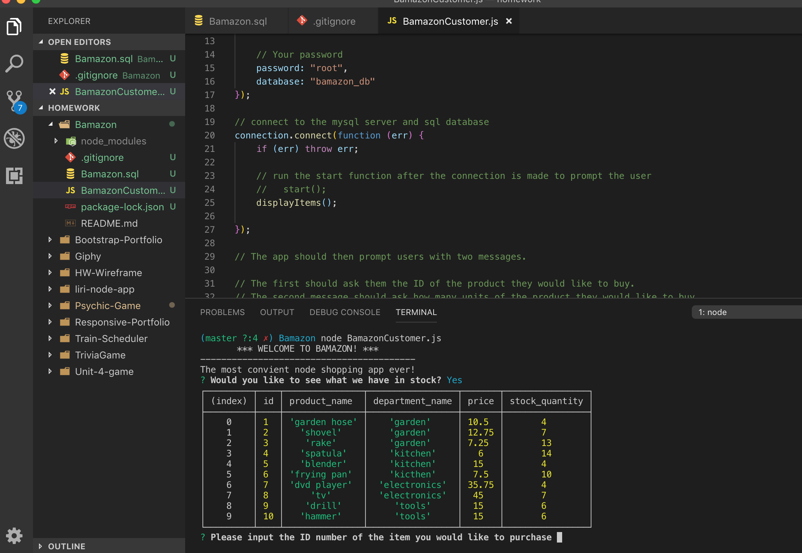
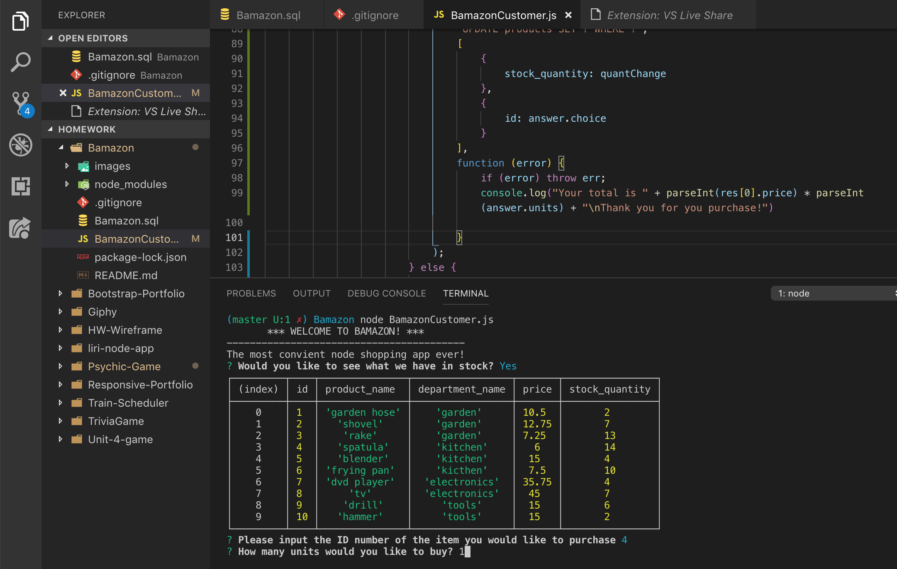
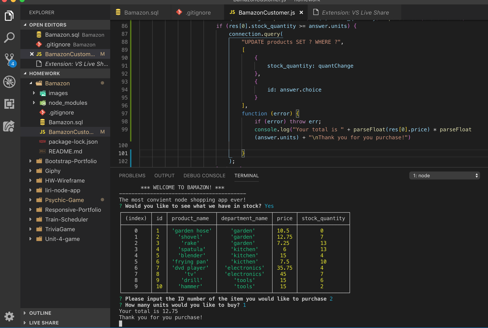
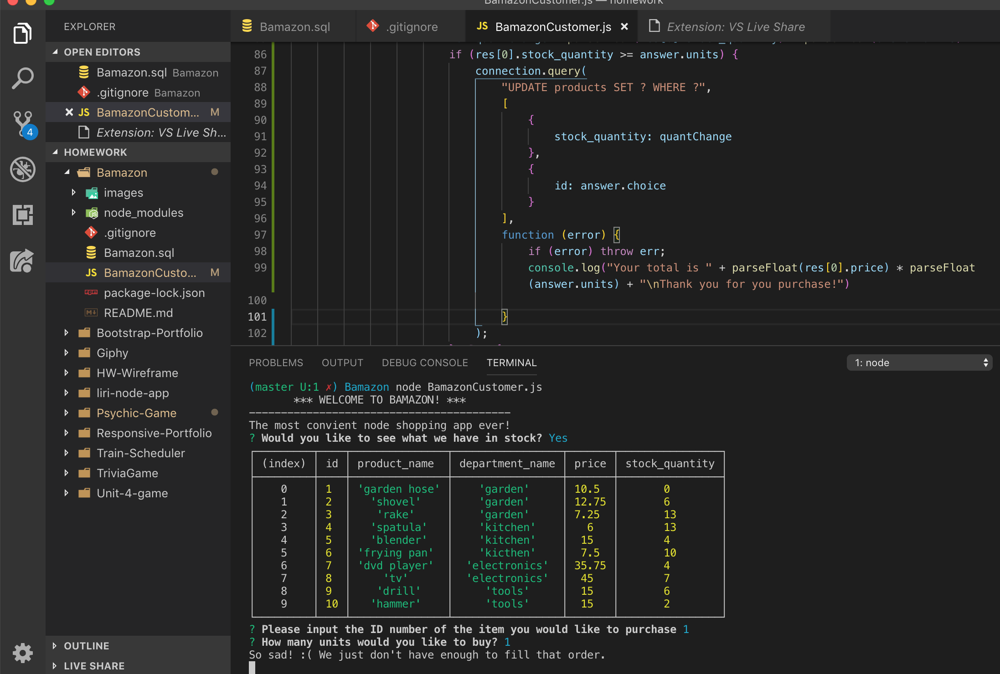

# Bamazon
Node.js & MySQL

About

Bamazon is an Amazon-like storefront suing MySQL and Node.js. This app takes in orders from customers and depletes stock from the store's inventory. 

What it does

When the bamazon page is loaded the customer is greeted to the store and asked if they would like to see what's in stock

If the customer responds "yes" the table of products is loaded for the customer to view. The table inside of the database holds each of the following columns:

item_id (unique id for each product)

product_name (Name of product)

department_name

price (cost to customer)

stock_quantity (how much of the product is available in stores)

The customer is then asked to input the ID number and how many units they would like to purchase

Once the product is selected and the number of units chosen, the total is displayed on the screen with a thank you message

If there is not enough product in stock an error message will display for the customer stating that the order cannot be fufilled 

